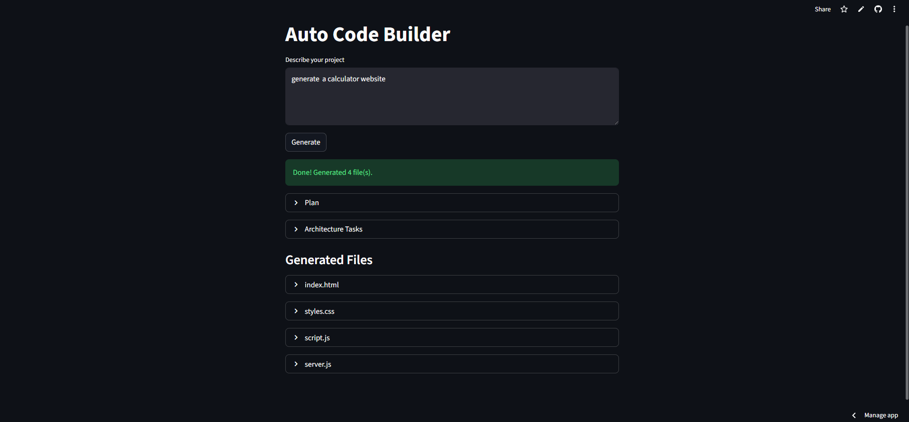
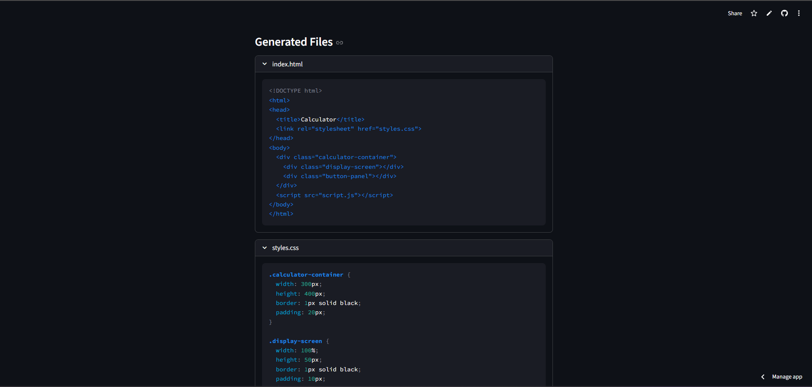

# Auto Code Builder (LangGraph + LLM)

An **AI-powered multi-agent code generation system** that automatically creates a full project structure from a simple natural language prompt.

The system uses a **LangGraph agent pipeline** where different AI agents collaborate to:

1. Plan the project  
2. Design the architecture  
3. Generate the code files  

Users simply describe the application they want, and the system produces a **ready-to-use codebase**.

---

# Project Demo

## Application Interface

---

## Generated Code Files

---

# Features

- AI-powered **automatic code generation**
- **Multi-agent architecture** using LangGraph
- Generates **multiple files for a project**
- Automatic **project planning**
- Automatic **architecture design**
- Generates **frontend and backend code**
- Clean **interactive UI**
- Automatically saves generated code to project folder

---

# System Architecture

The project follows a **multi-agent workflow architecture** where each agent performs a specific task.

<pre>
User Prompt
      ↓
Planner Agent
      ↓
Architect Agent
      ↓
Coder Agent
      ↓
Generated Code Files
</pre>

    
Each agent updates a **shared state** that flows through the LangGraph pipeline.

---

# Agents Explanation

## Planner Agent

The **Planner Agent** understands the user's request and generates a **high-level development plan**.

Example output:

- Project goal
- Required features
- Suggested technologies

---

## Architect Agent

The **Architect Agent** converts the plan into a **technical design**.

Example output:

- Project structure
- Required files
- Responsibilities of each component

---
## Project Structure

<pre>
auto-code-builder
│
├── agents
│   ├── graph.py
│   ├── prompts.py
│
├── app
│   └── streamlit\_app.py
│
├── generated\_project
│
├── assets
│   ├── ui.png
│   └── files.png
│
├── requirements.txt
└── README.md

  </pre>

Auto Code Builder (LangGraph + LLM)

🚀 Live Demo:
👉 https://ai-auto-code-builder-using-langgraph-and-llm-agents-cgvcvzsavp.streamlit.app/
